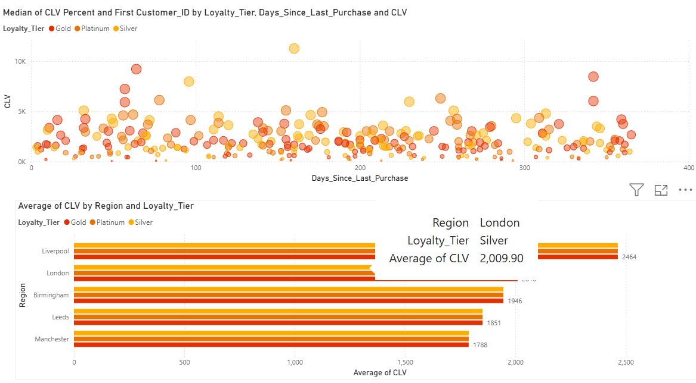

# IKEA Power BI Analytics Project

## Project Overview
This project analyzes IKEA customer transaction data using Power BI
to uncover insights related to churn, customer lifetime value (CLV),
repeat purchases, and loyalty behavior.

## Business Objectives
- Identify high-churn customer segments
- Analyze CLV across regions and income groups
- Evaluate repeat purchase behavior
- Support data-driven retention strategies

## Dashboards Created
- Executive Overview (KPIs)
- Customer Loyalty Analysis
- Churn & Retention Funnel

## Tools Used
- Power BI
- DAX
- Power Query
- Excel / CSV

## Files Included
- Power BI (.pbix) dashboard
- Cleaned dataset
- Insight report (PDF)
- Dashboard screenshots
- ## 📊 Dashboard Screenshots

### Churn Analysis

### Loyalty Analysis

### Loyalty Analysis

### Loyalty Analysis

## Key Insights
- High churn observed in low-income segments
- Loyalty members show 2.3× higher CLV
- Repeat purchase rate is strongest in metro regions

## Outcome
This project demonstrates real-world business analytics,
data modeling, and storytelling using Power BI.
